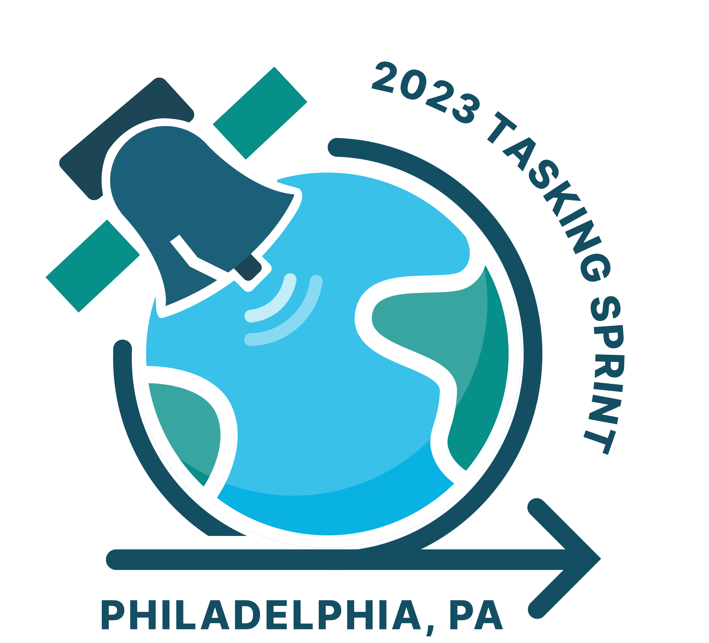
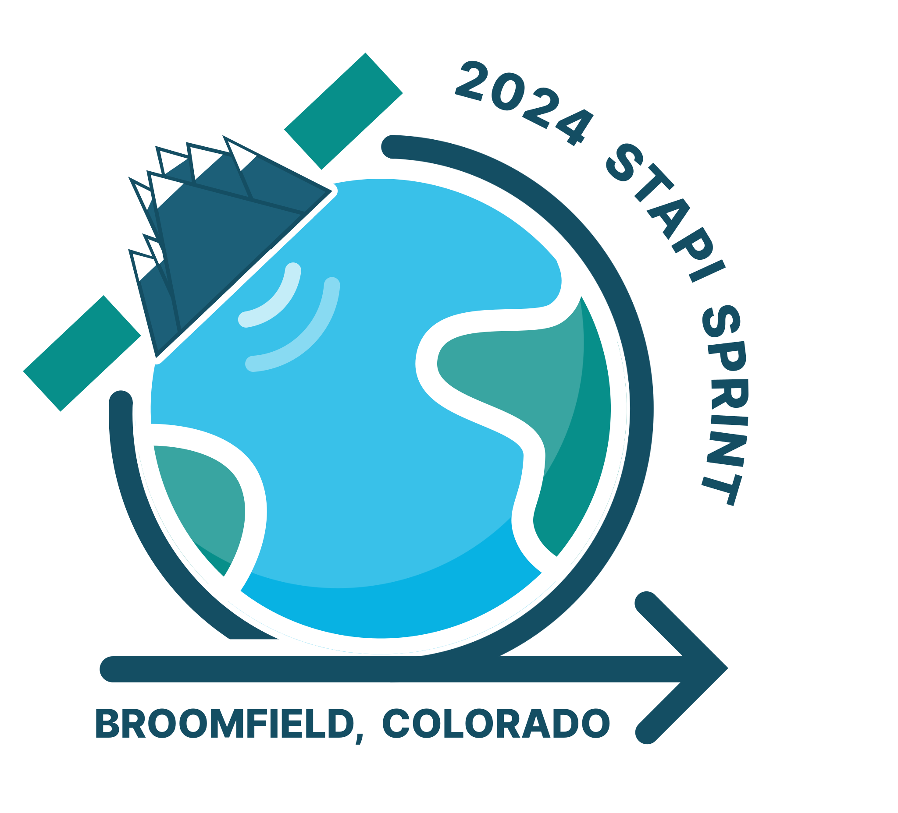
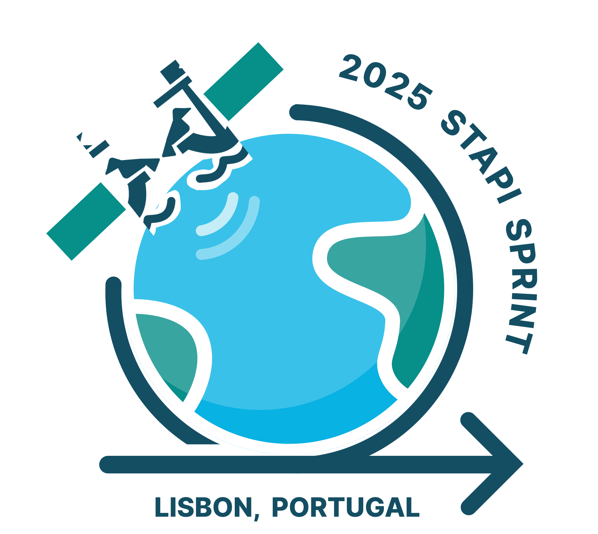

# STAPI Community Sprints

Notes and artifacts from STAPI community sprints, for work developing the
[STAPI spec](https://github.com/stapi-spec/stapi-spec) and associated tooling.

## Sprints to date

1. Alexandria, VA, USA -- September 27, 2022

   First STAPI Sprint!

   - [Notes](sprint1/README.md)
   - [Blog Post](https://element84.com/blog/tasking-sprint)

1. Philadelphia, PA, USA -- March 27-28, 2023

   

   - [Notes](sprint1/README.md)
   - [Blog Post](https://element84.com/geospatial/spatiotemporal-asset-tasking-sprint-2-recap/)

1. Berlin, Germany -- April 16-18, 2024

   

   - [Blog Post](https://element84.com/software-engineering/tasking-sprint-3-recap/)

1. Broomfield, CO, USA -- October, 8-9, 2024

   

   - [Blog Post](https://element84.com/open-source/stapi-sprint-4-interoperability-for-satellite-data-ordering/)

1. Lisbon, Portugal -- April 1-3, 2025

   

   - [Blog Post](https://element84.com/open-source/stapi-sprint-5-0-1-release/)

1. Philadelphia, PA, USA -- October 21-23, 2025

   - [Registration is open now!](https://lu.ma/h7wybmox)
